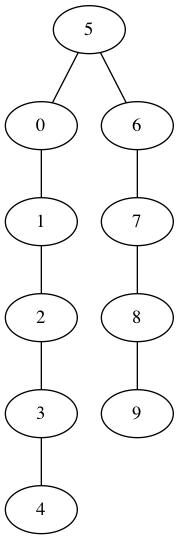
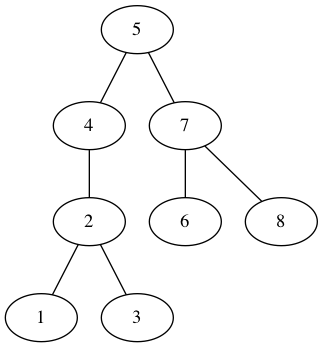
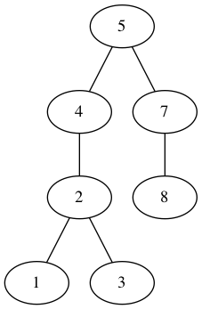
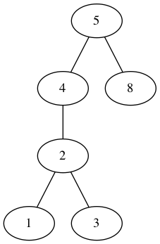
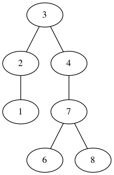

gotree [](https://travis-ci.org/gyuho/gotree) [](http://godoc.org/github.com/gyuho/gotree) [](http://www.ohloh.net/p/714469)
==========

gotree provides tree visualizing tools and algorithm implementations.

- [Getting Started](https://github.com/gyuho/gotree#getting-started)
- [Package Hierarchy](https://github.com/gyuho/gotree#package-hierarchy)
- [Example : Binary Search Tree](https://github.com/gyuho/gotree#example--binary-search-tree)
- [AVL Tree](https://github.com/gyuho/gotree#avl-tree)
- [Example : AVL Tree](https://github.com/gyuho/gotree#testing-graphs)
- [Red Black Tree](https://github.com/gyuho/gotree#avl-tree)
- [Example : Red Black Tree](https://github.com/gyuho/gotree#example--red-black-tree)
- [B-Tree](https://github.com/gyuho/gotree#b-tree)
- [Example : B-Tree](https://github.com/gyuho/gotree#example--b-tree)
- [To-Do-List](https://github.com/gyuho/gotree#to-do-list)


Getting Started
==========
- [godoc.org](http://godoc.org/github.com/gyuho/gotree)
- [gowalker.org](http://gowalker.org/github.com/gyuho/gotree#_index)

```go
// to install, in the command line
mkdir $HOME/go
export GOPATH=$HOME/go
go get github.com/gyuho/gotree

// to include, in the code
import "github.com/gyuho/gotree"

// to call the function, in the code
[package_name].[function]

// to execute
go install
// or
go build
```


Package Hierarchy
==========
```go
tree/     # Tree Data Structure
  
  bst/    # Binary Search Tree
  bstviz/ # Visualization (Graphviz)
  
  avl/    # AVL Tree
  avlviz/ # Visualization (Graphviz)

  rbt/    # Red Black Tree
  rbtviz/ # Visualization (Graphviz)
  
  bt/     # B-Tree
  btviz/  # Visualization (Graphviz)


example/  # Example Code
```


Example : Binary Search Tree
==========
```go
tr := bst.NewTree(5)
for i := 0; i < 10; i++ {
	if i != 5 {
		tr = tr.Insert(int64(i))
	}
}
Show(tr, "tree1.dot")
```



<hr>

```go
tr := bst.NewTree(5)
tr.Inserts(7, 8, 5, 4, 2, 1, 6, 3)
Show(tr, "tree2.dot")
```



<hr>

```go
tr := bst.NewTree(5)
tr.Inserts(7, 8, 5, 4, 2, 1, 6, 3)
tr.Delete(int64(6))
Show(tr, "tree3.dot")
```



<hr>

```go
tr := bst.NewTree(5)
tr.Inserts(7, 8, 4, 2, 1, 3)
tr.Delete(int64(7))
Show(tr, "tree4.dot")
```



<hr>

```go
tr := bst.NewTree(5)
tr.Inserts(7, 8, 3, 4, 2, 1, 6)
tr = tr.Delete(int64(5))
Show(tr, "tree5.dot")
```



<hr>


<a href="http://en.wikipedia.org/wiki/AVL_tree" target="_blank">AVL Tree</a>
==========
AVL tree is a self-balancing binary search tree.

For lookup-intensive applications, AVL trees are faster than red-black trees because they are more rigidly balanced. Similar to red-black trees, AVL trees are height-balanced. Both are in general not weight-balanced

**It is basically a Binary Search Tree (BST) with additional balancing property:**

**`Height of the Left Sub-Tree`** and **`Height of the Right Sub-Tree`** differ by at most 1

**Balance(Tree)** = **Height(Left)** - **Height(Right)** = -1, 0, 1

For example,
```
  1
 / \
    2
   / \
  3   4
```
The node 2 is balanced, but the node 1 is NOT balanced
because the Height(Left) is 0 and Height(Right) is 2

##### Insertion
1. Insert into Left-Sub of Left-Child
2. Insert into Right-Sub of Right-Child
3. Insert into Left-Sub of Right-Child
4. Insert into Right-Sub of Left-Child

##### Rotation for Re-balancing
1. LL Rotation
2. RR Rotation
3. LR Rotation
4. RL Rotation

<hr>

##### Rebalance (Rearrange)

1. LL Rotation

Unbalanced!
```
    4
   /
  3
 /
2
```

then
```
   3
  / \
 2   4
```

<hr>

2. RR Rotation

Unbalanced!
```
    6
     \
      7
       \
        8
```

then
```
   7
  / \
 6   8
```

<hr>

3. LR Rotation

Unbalanced!
```
    4
   /
  2
   \
    3
```

then
```
   3
  / \
 2   4
```
<hr>

4. RL Rotation

Unbalanced!
```
    6
     \
      8
     /
    7
```

then
```
   7
  / \
 6   8
```

<hr>

##### Determine which rotation to use
**`Height(Unbalanced-Node)`** is:
	- **Positive**: Left-Child (Example Height = 2)
		- If **`Height(Left-Child)`** is:
			- Positive: `LL Rotation` (Example Height = 1)
			- Negative: `LR Rotation` (Example Height = -1)
	- **Negative**: Right-Child (Example Height = 2)
		- If **`Height(Right-Child)`** is:
			- Positive: `RL Rotation` (Example Height = 1)
			- Negative: `RR Rotation` (Example Height = -1)


To-Do-List
==========
**Non-Committal on a Timeline**

- More Tree Data Structures
